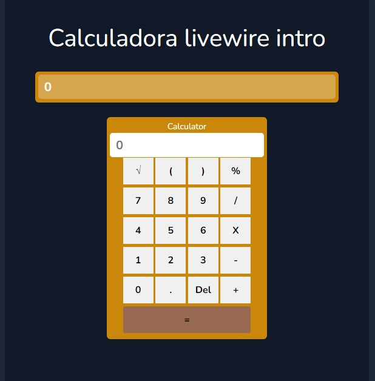

	

	
    
    
    
	

## Projeto calculadora

Este é uma `aplicação Laravel` utilizando a "extensão" `Livewire`. Uma extensão reativa, que agiliza o desenvolvimento
com `componentes reativo` "sem" o uso de javascript (Existe o javascript, mas não precisamos se preocupar com  desenvolvimento).

> Com livewire temos componentes responsivos e juntamente com o blade, temos uma ferramenta poderosa. Componentes que podemos atualizar sem
>precisar atualizar toda página de forma fácil e rápida.

##### Comandos e desenvolvimento
- [--] composer create-project laravel/laravel name-project
- [--] composer require livewire/livewire
- [--] 
- [--] 

######  Tecnologias (serviços externos, libs, frameworks, hospedagem etc.)

- <a href="#" target="_blank">Php `8.2`</a>
- <a href="#" target="_blank">Laravel `9.52.5`</a>
- <a href="#" target="_blank">Livewire `2.x`</a>

## Contatos

- 👇🏼 [rafaelblum_digital@hotmail.com]

 
    <em><b>Adoro me conectar com pessoas diferentes,</b> então se você quiser dizer <b>oi, ficarei feliz em conhecê-lo mais!</b> :)</em>

